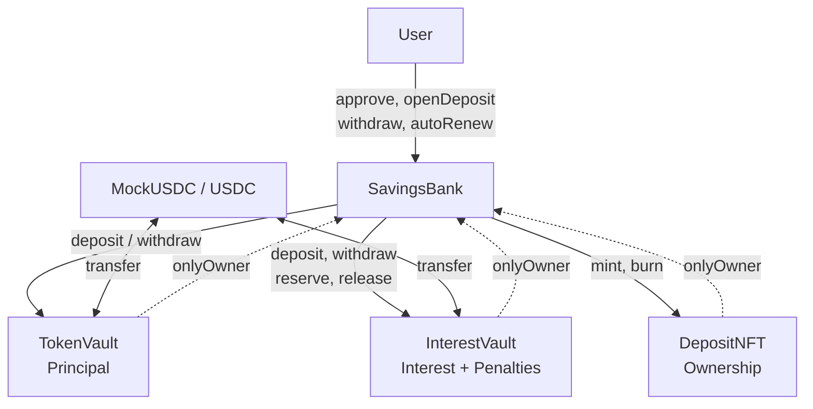

# 🏦 DeFi Savings Protocol

> **Capstone Project - Blockchain Development Internship**  
> **Author:** Nguyễn Ngọc Huy - AppsCyclone  
> **Timeline:** January 26-30, 2026

Hệ thống tiết kiệm phi tập trung (DeFi) trên Ethereum: user mở sổ tiết kiệm có kỳ hạn, nhận lãi cố định, rút đúng hạn hoặc rút sớm (chịu phạt), tự động gia hạn (auto-renew) hoặc gửi lại thủ công (manual renew).

---

## 📋 Overview

**DeFi Savings Protocol** mô phỏng sổ tiết kiệm ngân hàng trên blockchain:

- 💰 **Mở deposit** — Chọn plan (7 / 30 / 90 ngày), gửi USDC, nhận NFT chứng nhận
- 📈 **Nhận lãi** — Lãi đơn theo APR và kỳ hạn
- 💸 **Rút tiền** — Rút đúng hạn (gốc + lãi) hoặc rút sớm (gốc − phạt, không lãi)
- ♻️ **Auto-renew** — Tự động gia hạn với **APR cũ (locked)** trong 2 ngày sau đáo hạn
- 🔄 **Manual renew** — Rút rồi gửi lại với **APR mới** của plan
- 🎫 **NFT certificate** — Mỗi deposit = 1 NFT (ERC721), tokenId = depositId

### Tech Stack

- **Smart Contracts:** Solidity ^0.8.20
- **Framework:** Hardhat, hardhat-deploy
- **Testing:** Hardhat + Ethers.js
- **Libraries:** OpenZeppelin Contracts
- **Network:** Ethereum Sepolia Testnet (hoặc localhost)

---

## 🏗️ High Level Architecture

Hệ thống gồm **một orchestrator (SavingsBank)** và **các vault/NFT tách biệt**. SavingsBank **không giữ token**; chỉ điều phối chuyển token giữa User, TokenVault và InterestVault.

### Components

| Component | Vai trò |
|-----------|--------|
| **SavingsBank** | Orchestrator: plan, deposit lifecycle, interest logic. Ownable, Pausable, ReentrancyGuard. **Không giữ token.** |
| **TokenVault** | Giữ **principal** (gốc). Chỉ SavingsBank gọi deposit/withdraw. |
| **InterestVault** | Giữ **liquidity trả lãi** + **penalty** rút sớm. reserve/release cho interest. Chỉ SavingsBank. |
| **DepositNFT** | ERC721 đại diện quyền sở hữu deposit. Chỉ SavingsBank mint/burn. |
| **MockUSDC / USDC** | Token gửi/rút (6 decimals). |

### Architecture Diagram (Mermaid)



### Data Flow (tóm tắt)

| Luồng | Token (USDC) | Reserve/Release | NFT |
|-------|--------------|------------------|-----|
| **openDeposit** | User → TokenVault (principal) | InterestVault.reserve(estimatedInterest) | mint(user) |
| **withdraw** | TokenVault → User (principal), InterestVault → User (interest) | InterestVault.release(interest) | burn |
| **earlyWithdraw** | TokenVault → User (principal − penalty); penalty → InterestVault | InterestVault.release(reservedInterest) | burn |
| **autoRenew** | Interest → compound vào TokenVault (không ra user) | release(interest), reserve(newInterest) | burn(old), mint(new) |
| **fundVault** (admin) | Admin → InterestVault | — | — |
| **withdrawVault** (admin) | InterestVault → Admin (chỉ available) | — | — |

Chi tiết từng bước (sequence diagram, điều kiện, state): **[docs/ARCHITECTURE.md](./docs/ARCHITECTURE.md)** § 3. Data Flow.

### Access Control (tóm tắt)

- **SavingsBank:** Owner = Admin. Admin: createPlan, updatePlan, enablePlan, fundVault, withdrawVault, pause, unpause.
- **TokenVault, InterestVault, DepositNFT:** Owner = SavingsBank. Chỉ SavingsBank gọi deposit/withdraw/reserve/release/mint/burn.
- **User:** openDeposit, withdraw, earlyWithdraw, autoRenew, setAutoRenew (nếu là owner của NFT).

📖 **Chi tiết:** [docs/ARCHITECTURE.md](./docs/ARCHITECTURE.md) — High Level Architecture, Components, Data Flow, Access Control (đầy đủ).

---

## 📂 Documentation

| Tài liệu | Nội dung |
|----------|----------|
| **[docs/ARCHITECTURE.md](./docs/ARCHITECTURE.md)** | High Level Architecture, Components, Data Flow, Access Control, diagram |
| **[docs/DEPLOYMENT.md](./docs/DEPLOYMENT.md)** | Deploy: env, thứ tự deploy, fresh deploy, verify |
| **[docs/SCRIPTS.md](./docs/SCRIPTS.md)** | Scripts: deploy, test-deployment, helpers |
| **[scripts/test-deployment/README.md](./scripts/test-deployment/README.md)** | Hướng dẫn chạy test script sau deploy |

---

## 🚀 Getting Started

### Prerequisites

- Node.js v16+
- Yarn hoặc npm
- Private key (Sepolia) — không commit

### Install

```bash
git clone <repository-url>
cd capstone-defi-savings-protocol
yarn install
cp .env_example .env
# Điền TESTNET_PRIVATE_KEY (và ETHERSCAN_API_KEY nếu cần)
```

### Compile & Test

```bash
npx hardhat compile
npx hardhat test
```

### Deploy (Sepolia)

```bash
npx hardhat deploy --network sepolia
```

Sau deploy: chạy script kiểm tra (xem [docs/SCRIPTS.md](./docs/SCRIPTS.md)):

```bash
npx hardhat run scripts/test-deployment/00_check_deployment.ts --network sepolia
npx hardhat run scripts/test-deployment/01_setup_verification.ts --network sepolia
```

---

## 📊 Deployed Contracts (Sepolia)

Sau khi deploy, địa chỉ lưu tại `deployments/sepolia/`. Có thể xem bằng:

```bash
npx hardhat run scripts/test-deployment/00_check_deployment.ts --network sepolia
```

---

## 🎮 Usage (User)

1. **Approve USDC cho TokenVault**
2. **openDeposit(planId, amount, enableAutoRenew)** → nhận NFT (tokenId = depositId)
3. **Sau đáo hạn:** withdraw(tokenId) hoặc autoRenew(tokenId) (nếu bật, trong 2 ngày)
4. **Rút sớm:** earlyWithdraw(tokenId) — nhận gốc − phạt, không lãi

Admin: createPlan, fundVault, updatePlan, enablePlan, pause/unpause — xem [docs/ARCHITECTURE.md](./docs/ARCHITECTURE.md).

---

## 🛡️ Security

- ReentrancyGuard trên hàm gọi vault/transfer
- Pausable (admin)
- Vault tách biệt, chỉ SavingsBank điều khiển
- SavingsBank không giữ token
- Auto-renew lock APR bảo vệ user khi admin đổi plan

⚠️ Dự án capstone, chưa audit chuyên nghiệp. Không dùng với tiền thật.

---

## 🧪 Testing

- Unit tests: `test/unit/` (SavingsBank, InterestCalculator, MockUSDC)
- Test script sau deploy: `scripts/test-deployment/`

```bash
npx hardhat test
npx hardhat run scripts/test-deployment/99_full_e2e_test.ts   # localhost (full E2E)
```

---

## 📝 License

Dự án giáo dục — Capstone Blockchain Development Internship.

---

## 👨‍💻 Author

**Nguyễn Ngọc Huy** — Blockchain Development Intern, AppsCyclone — January 2025

---

> **Status:** ✅ Blockchain hoàn thiện — Sẵn sàng tích hợp frontend  
> **Last Updated:** January 2026
