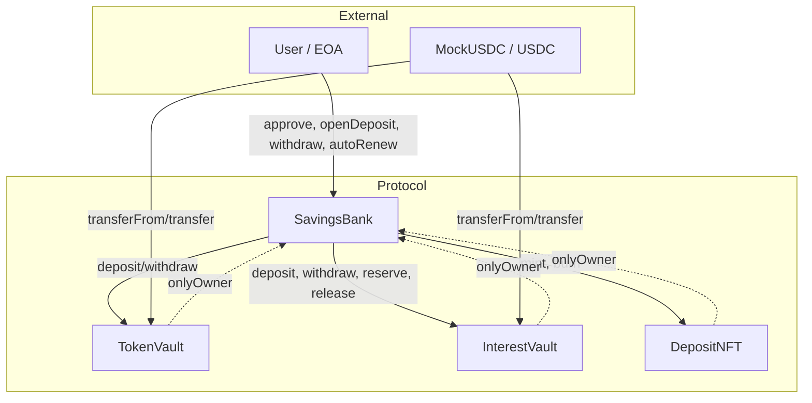
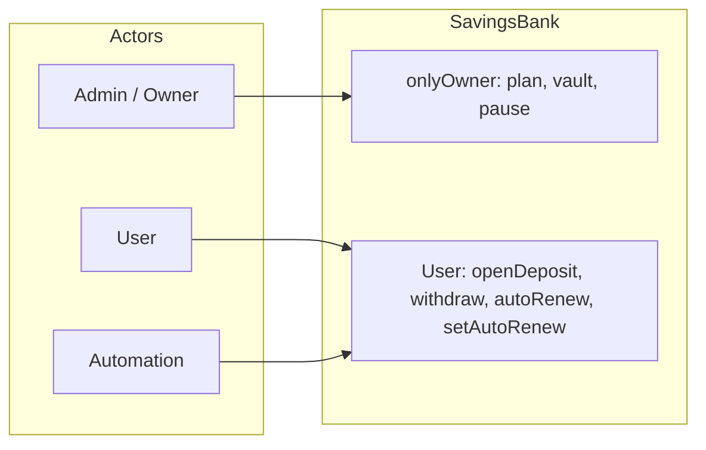

# DeFi Savings Protocol — Architecture

Tài liệu mô tả kiến trúc hệ thống, components, data flow và access control.

---

## 1. High Level Architecture

Hệ thống gồm **một orchestrator (SavingsBank)** và **các vault/NFT tách biệt**. SavingsBank **không giữ token**; chỉ điều phối chuyển token giữa User, TokenVault và InterestVault.

```
┌─────────────────────────────────────────────────────────────────────────────┐
│                        DeFi Savings Protocol                                 │
├─────────────────────────────────────────────────────────────────────────────┤
│                                                                              │
│   ┌──────────┐                    ┌─────────────────────────────────────┐   │
│   │  User    │◄─── approve ───────│  MockUSDC / USDC (ERC20)             │   │
│   │  (EOA)   │                    │  Token for deposits & interest       │   │
│   └────┬─────┘                    └─────────────────────────────────────┘   │
│        │                                         │                           │
│        │ openDeposit / withdraw /                │ transferFrom / transfer   │
│        │ earlyWithdraw / autoRenew               │                           │
│        ▼                                         ▼                           │
│   ┌─────────────────────────────────────────────────────────────────────┐   │
│   │                     SavingsBank (Orchestrator)                         │   │
│   │  • Plan management  • Deposit lifecycle  • Interest calculation        │   │
│   │  • ReentrancyGuard  • Pausable  • Ownable (Admin)                       │   │
│   │  • KHÔNG giữ token — chỉ gọi vault/NFT                                │   │
│   └───────┬─────────────────────┬─────────────────────┬──────────────────┘   │
│           │ onlyOwner            │ onlyOwner            │ onlyOwner            │
│           ▼                      ▼                      ▼                      │
│   ┌───────────────┐    ┌─────────────────┐    ┌─────────────────┐            │
│   │  TokenVault   │    │  InterestVault  │    │  DepositNFT     │            │
│   │  Principal    │    │  Interest +     │    │  (ERC721)        │            │
│   │  (gốc tiền)   │    │  Penalties      │    │  Ownership       │            │
│   └───────────────┘    └─────────────────┘    └─────────────────┘            │
│                                                                              │
│   ┌───────────────┐                                                          │
│   │  Admin       │  createPlan, fundVault, pause, updatePlan, enablePlan    │
│   │  (Owner)     │  withdrawVault                                            │
│   └───────────────┘                                                          │
└─────────────────────────────────────────────────────────────────────────────┘
```

### Diagram (Mermaid)



---

## 2. Components

### 2.1 Core Contracts

| Component | File | Mô tả |
|-----------|------|--------|
| **SavingsBank** | `SavingsBank.sol` | Orchestrator: toàn bộ business logic (plan, deposit, withdraw, autoRenew). Ownable, Pausable, ReentrancyGuard. **Không giữ token.** |
| **TokenVault** | `TokenVault.sol` | Vault giữ **principal** (gốc) của user. Chỉ owner (SavingsBank) gọi `deposit(from, amount)` / `withdraw(to, amount)`. |
| **InterestVault** | `InterestVault.sol` | Vault giữ **liquidity trả lãi** + **penalty** rút sớm. Có `reserve(amount)` / `release(amount)` cho interest của deposit đang active. Chỉ owner (SavingsBank) gọi. |
| **DepositNFT / MockDepositNFT** | `DepositNFT.sol` / `MockDepositNFT.sol` | ERC721 đại diện quyền sở hữu deposit. TokenId = depositId. Chỉ owner (SavingsBank) mint/burn. |

### 2.2 Supporting

| Component | File | Mô tả |
|-----------|------|--------|
| **InterestCalculator** | `libraries/InterestCalculator.sol` | Library: `calculateInterest(principal, aprBps, durationDays)`, `calculatePenalty(principal, penaltyBps)`. |
| **MockUSDC** | `mocks/MockUSDC.sol` | ERC20 6 decimals, có `mint()` cho testnet. Mainnet dùng USDC thật. |

### 2.3 Data Structures (SavingsBank)

- **SavingPlan**: name, durationDays, minDeposit, maxDeposit, aprBps, earlyWithdrawPenaltyBps, isActive.
- **DepositCertificate**: planId, principal, startTime, maturityTime, lockedAprBps, isAutoRenewEnabled, status (Active / Withdrawn / EarlyWithdrawn / Renewed).

---

## 3. Data Flow

Tất cả luồng đều qua **SavingsBank**; SavingsBank gọi TokenVault / InterestVault / DepositNFT (onlyOwner). USDC luôn chuyển qua vault, không qua SavingsBank.

### 3.1 User Deposit (openDeposit)

**Điều kiện:** Plan active, amount ∈ [minDeposit, maxDeposit], InterestVault có đủ available balance, User đã approve TokenVault.

```
User                    SavingsBank                 TokenVault              InterestVault           DepositNFT
  |                          |                           |                        |                     |
  | approve(TokenVault, amount)                           |                        |                     |
  |------------------------------------------------------->| (off-chain / trước)    |                     |
  | openDeposit(planId, amount, enableAutoRenew)          |                        |                     |
  |------------------------->|                           |                        |                     |
  |                          | reserve(estimatedInterest) |                        |                     |
  |                          |------------------------------------------------------>| totalReserved += X |
  |                          | deposit(msg.sender, amount)|                        |                     |
  |                          |-------------------------->| USDC.safeTransferFrom(user, TV, amount)        |
  |                          | deposits[depositId] = cert |                        |                     |
  |                          | depositOwner[depositId] = msg.sender                |                     |
  |                          | mint(msg.sender)          |                        |                     |
  |                          |---------------------------------------------------------------------------->|
  |<-------------------------| return depositId         |                        |                     |
```

- **Principal:** User → TokenVault (TokenVault gọi `USDC.safeTransferFrom(user, this, amount)`).
- **Interest:** InterestVault `reserve(estimatedInterest)` → `totalReserved += amount`; phải `amount <= availableBalance()`.
- **Ownership:** DepositNFT `mint(user)`; tokenId = depositId. `depositOwner[depositId] = msg.sender` (để admin biết chủ sau khi NFT burn).

### 3.2 Withdraw at Maturity (withdraw)

**Điều kiện:** Caller = owner của NFT (depositNFT.ownerOf(tokenId)), cert.status = ACTIVE, block.timestamp >= maturityTime.

```
User                    SavingsBank                 TokenVault              InterestVault           DepositNFT
  |                          |                           |                        |                     |
  | withdraw(tokenId)        |                           |                        |                     |
  |------------------------->|                           |                        |                     |
  |                          | interest = calculateInterest(principal, lockedAprBps, durationDays)         |
  |                          | release(interest)         |                        |                     |
  |                          |------------------------------------------------------>| totalReserved -= X |
  |                          | cert.status = WITHDRAWN   |                        |                     |
  |                          | withdraw(user, principal) |                        |                     |
  |                          |-------------------------->| USDC.safeTransfer(user, principal)            |
  |                          | withdraw(user, interest)  |                        |                     |
  |                          |------------------------------------------>| USDC.safeTransfer(user, interest) |
  |                          | burn(tokenId)             |                        |                     |
  |                          |---------------------------------------------------------------------------->|
  |<-------------------------| (user đã nhận principal + interest trên chain)     |                     |
```

- **Principal:** TokenVault → User.
- **Interest:** InterestVault `release(interest)` rồi `withdraw(user, interest)` → User nhận lãi.
- **NFT:** Burn; certificate status = WITHDRAWN.

### 3.3 Early Withdraw (earlyWithdraw)

**Điều kiện:** Caller = owner của NFT, cert.status = ACTIVE, block.timestamp < maturityTime.

```
User                    SavingsBank                 TokenVault              InterestVault           DepositNFT
  |                          |                           |                        |                     |
  | earlyWithdraw(tokenId)   |                           |                        |                     |
  |------------------------->|                           |                        |                     |
  |                          | penalty = principal * penaltyBps / 10000            |                     |
  |                          | userReceives = principal - penalty                  |                     |
  |                          | reservedInterest = calculateInterest(...)          |                     |
  |                          | release(reservedInterest) |                        |                     |
  |                          |------------------------------------------------------>| totalReserved -= X |
  |                          | cert.status = EARLY_WITHDRAWN                       |                     |
  |                          | withdraw(user, userReceives)                        |                     |
  |                          |-------------------------->| USDC → user (gốc − phạt)                     |
  |                          | withdraw(SB, penalty)     |                        |                     |
  |                          |-------------------------->| USDC → SavingsBank (penalty)                 |
  |                          | approve(InterestVault)    |                        |                     |
  |                          | (SavingsBank approve IV)  |                        |                     |
  |                          | deposit(SavingsBank, penalty)                       |                     |
  |                          |------------------------------------------>| USDC: SB → IV (penalty)  |
  |                          | burn(tokenId)             |                        |                     |
  |                          |---------------------------------------------------------------------------->|
  |<-------------------------| (user đã nhận principal - penalty)                  |                     |
```

- **User nhận:** Chỉ `principal - penalty` (từ TokenVault).
- **Penalty:** TokenVault → SavingsBank (withdraw to SB) → SavingsBank approve InterestVault → InterestVault.deposit(SB, penalty) → penalty vào InterestVault (tăng liquidity).
- **Reserved interest:** Release (không trả lãi cho user).
- **NFT:** Burn; cert.status = EARLY_WITHDRAWN.

### 3.4 Auto-Renew (autoRenew)

**Điều kiện:** Caller = owner của NFT, cert.status = ACTIVE, isAutoRenewEnabled, block.timestamp >= maturityTime, block.timestamp <= maturityTime + 2 days.

```
User                    SavingsBank                 TokenVault              InterestVault           DepositNFT
  |                          |                           |                        |                     |
  | autoRenew(tokenId)       |                           |                        |                     |
  |------------------------->|                           |                        |                     |
  |                          | interest = calculateInterest(oldCert)               |                     |
  |                          | newPrincipal = oldPrincipal + interest              |                     |
  |                          | release(interest)         |                        |                     |
  |                          |------------------------------------------------------>| totalReserved -= X |
  |                          | withdraw(SB, interest)    |                        |                     |
  |                          |------------------------------------------>| USDC: IV → SB            |
  |                          | approve(TokenVault)       |                        |                     |
  |                          | deposit(SB, interest)     |                        |                     |
  |                          |-------------------------->| (compound: interest vào TV)                  |
  |                          | reserve(newEstimatedInterest)                      |                     |
  |                          |------------------------------------------------------>| totalReserved += Y |
  |                          | oldCert.status = RENEWED  |                        |                     |
  |                          | burn(oldTokenId)          |                        |                     |
  |                          |---------------------------------------------------------------------------->|
  |                          | deposits[newId] = newCert (lockedAprBps, same duration)                   |
  |                          | depositOwner[newId] = user |                        |                     |
  |                          | mint(user)                |                        |                     |
  |                          |---------------------------------------------------------------------------->|
  |<-------------------------| return newDepositId       |                        |                     |
```

- **Interest cũ:** Release từ InterestVault → rút về SavingsBank → approve TokenVault → deposit vào TokenVault (compound).
- **Deposit mới:** principal = oldPrincipal + interest, lockedAprBps và duration giữ nguyên (locked), reserve lãi mới cho deposit mới.
- **NFT:** Burn cũ, mint mới; cert cũ status = RENEWED.

### 3.5 Manual Renew

- User gọi **withdraw(tokenId)** → nhận gốc + lãi về ví.
- User gọi **openDeposit(planId, amount, enableAutoRenew)** với số tiền và plan tùy chọn. APR và duration theo **plan hiện tại** (không lock như autoRenew).

### 3.6 Admin: Fund Interest Vault (fundVault)

**Gọi bởi:** Admin (owner SavingsBank).

```
Admin                    SavingsBank                 InterestVault           USDC
  |                          |                           |                     |
  | approve(InterestVault, amount)                         |                     |
  |----------------------------------------------------------------------------->|
  | fundVault(amount)        |                           |                     |
  |------------------------->|                           |                     |
  |                          | interestVault.deposit(admin, amount)              |                     |
  |                          |-------------------------->|                     |
  |                          |                           | safeTransferFrom(admin, IV, amount)          |
  |                          |                           |<-------------------------------------------------|
  |<-------------------------|                           |                     |
```

- **Kết quả:** USDC từ ví Admin → InterestVault; tăng liquidity để reserve lãi cho deposit mới.

### 3.7 Admin: Withdraw from Interest Vault (withdrawVault)

**Gọi bởi:** Admin. **Điều kiện:** amount <= interestVault.availableBalance() (không rút phần reserved).

```
Admin                    SavingsBank                 InterestVault
  |                          |                           |
  | withdrawVault(amount)    |                           |
  |------------------------->|                           |
  |                          | interestVault.withdraw(admin, amount)             |
  |                          |-------------------------->|
  |                          |                           | safeTransfer(admin, amount)
  |<-------------------------------------------------------- (USDC: IV → Admin)
```

- **Kết quả:** USDC từ InterestVault → ví Admin (chỉ phần available).

### 3.8 Admin: Plan Management

| Hàm | Gọi bởi | Hiệu ứng |
|-----|---------|----------|
| **createPlan(name, durationDays, minDeposit, maxDeposit, aprBps, penaltyBps)** | Admin | Thêm savingPlans[nextPlanId]; nextPlanId++; plan mặc định isActive = true. |
| **updatePlan(planId, aprBps, earlyWithdrawPenaltyBps)** | Admin | Cập nhật aprBps và earlyWithdrawPenaltyBps của plan (không đổi min/max/duration). Deposit đang active vẫn dùng lockedAprBps. |
| **enablePlan(planId, enabled)** | Admin | savingPlans[planId].isActive = enabled. Plan tắt thì user không mở deposit mới với plan đó. |

Không có chuyển token; chỉ thay đổi state trong SavingsBank.

### 3.9 Admin: Pause / Unpause

| Hàm | Gọi bởi | Hiệu ứng |
|-----|---------|----------|
| **pause()** | Admin | Contract chuyển trạng thái paused. Khi paused: openDeposit, withdraw, earlyWithdraw, autoRenew revert (EnforcedPause). |
| **unpause()** | Admin | Bật lại; user có thể giao dịch bình thường. |

Không chuyển token; chỉ modifier whenNotPaused / whenPaused.

### 3.10 User: setAutoRenew(tokenId, enabled)

**Gọi bởi:** Owner của NFT. Chỉ cập nhật `deposits[depositId].isAutoRenewEnabled = enabled`. Không chuyển token, không gọi vault/NFT.

---

### 3.11 Tổng hợp luồng (summary)

| Luồng | Token chuyển (USDC) | Reserve/Release | NFT |
|-------|----------------------|------------------|-----|
| openDeposit | User → TokenVault (principal) | IV.reserve(estimatedInterest) | mint(user) |
| withdraw | TokenVault → User (principal), IV → User (interest) | IV.release(interest) | burn |
| earlyWithdraw | TokenVault → User (principal − penalty), TV → SB → IV (penalty) | IV.release(reservedInterest) | burn |
| autoRenew | IV → SB → TokenVault (interest compound), không chuyển ra user | IV.release(interest), IV.reserve(newInterest) | burn(old), mint(new) |
| fundVault | Admin → InterestVault | — | — |
| withdrawVault | InterestVault → Admin | — | — |
| createPlan / updatePlan / enablePlan / pause / unpause / setAutoRenew | Không | — | — |

---

## 4. Access Control

### 4.1 Ownership & Permissions

| Contract | Owner | Ai có thể gọi hàm đặc quyền |
|----------|--------|-----------------------------|
| **SavingsBank** | Admin (deployer) | Admin: createPlan, updatePlan, enablePlan, fundVault, withdrawVault, pause, unpause. |
| **TokenVault** | SavingsBank | Chỉ SavingsBank: deposit, withdraw. |
| **InterestVault** | SavingsBank | Chỉ SavingsBank: deposit, withdraw, reserve, release. |
| **DepositNFT** | SavingsBank | Chỉ SavingsBank: mint, burn. |

### 4.2 User vs Admin

| Hành động | Gọi bởi | Điều kiện |
|-----------|---------|-----------|
| openDeposit | User | approve TokenVault, plan active, amount trong [min, max], vault đủ available balance. |
| withdraw | User (owner của NFT) | Deposit ACTIVE, đã đáo hạn. |
| earlyWithdraw | User (owner của NFT) | Deposit ACTIVE, chưa đáo hạn. |
| autoRenew | User hoặc Automation | Deposit ACTIVE, đã đáo hạn, trong grace period, isAutoRenewEnabled. |
| setAutoRenew | User (owner của NFT) | Deposit ACTIVE. |
| createPlan, updatePlan, enablePlan | Admin | onlyOwner. |
| fundVault, withdrawVault | Admin | onlyOwner. |
| pause, unpause | Admin | onlyOwner. |

### 4.3 Diagram Access Control (Mermaid)



---

## 5. Constants & Config

| Constant | Value | Mô tả |
|----------|--------|--------|
| BPS_DENOMINATOR | 10_000 | 100% = 10000 bps. |
| AUTO_RENEW_GRACE_PERIOD | 2 days | Cửa sổ sau đáo hạn được gọi autoRenew. |
| STATUS_ACTIVE | 0 | Deposit đang active. |
| STATUS_WITHDRAWN | 1 | Đã rút đúng hạn. |
| STATUS_EARLY_WITHDRAWN | 2 | Đã rút sớm. |
| STATUS_RENEWED | 3 | Đã auto-renew (deposit cũ). |

---

## 6. Security Summary

- **ReentrancyGuard**: Tất cả hàm gọi vault/transfer đều qua `nonReentrant`.
- **Pausable**: Admin có thể pause; user không mở deposit / withdraw khi paused.
- **Vault tách biệt**: TokenVault và InterestVault chỉ nhận lệnh từ SavingsBank (onlyOwner).
- **SavingsBank không giữ token**: Giảm surface attack, dễ audit.
- **Auto-renew lock APR**: User được bảo vệ khi admin đổi APR plan (deposit cũ giữ lockedAprBps).

---

*Tài liệu kiến trúc — DeFi Savings Protocol. Cập nhật theo codebase hiện tại.*
