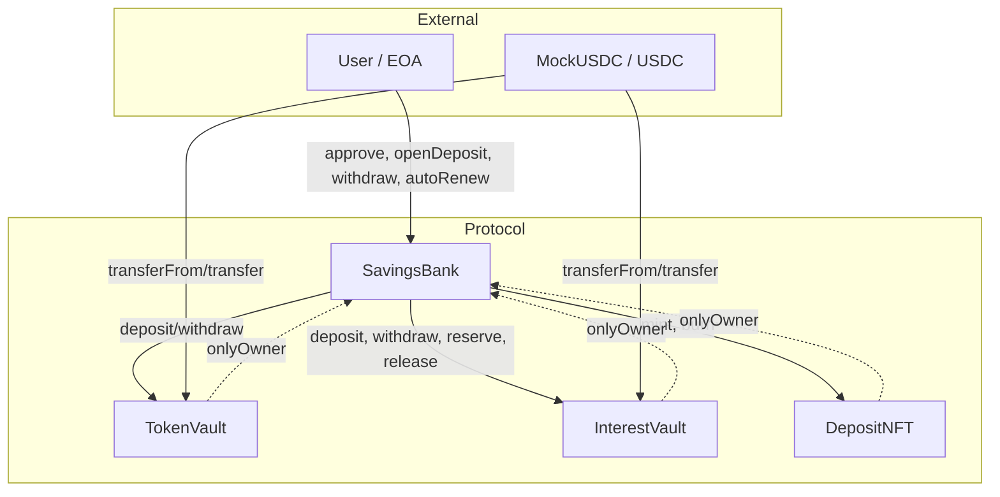
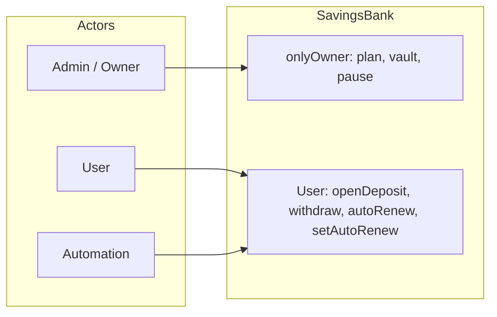

# DeFi Savings Protocol — Architecture

Tài liệu mô tả kiến trúc hệ thống, components, data flow và access control.

---

## 1. High Level Architecture

Hệ thống gồm **một orchestrator (SavingsBank)** và **các vault/NFT tách biệt**. SavingsBank **không giữ token**; chỉ điều phối chuyển token giữa User, TokenVault và InterestVault.

```
┌─────────────────────────────────────────────────────────────────────────────┐
│                        DeFi Savings Protocol                                 │
├─────────────────────────────────────────────────────────────────────────────┤
│                                                                              │
│   ┌──────────┐                    ┌─────────────────────────────────────┐   │
│   │  User    │◄─── approve ───────│  MockUSDC / USDC (ERC20)             │   │
│   │  (EOA)   │                    │  Token for deposits & interest       │   │
│   └────┬─────┘                    └─────────────────────────────────────┘   │
│        │                                         │                           │
│        │ openDeposit / withdraw /                │ transferFrom / transfer   │
│        │ earlyWithdraw / autoRenew               │                           │
│        ▼                                         ▼                           │
│   ┌─────────────────────────────────────────────────────────────────────┐   │
│   │                     SavingsBank (Orchestrator)                         │   │
│   │  • Plan management  • Deposit lifecycle  • Interest calculation        │   │
│   │  • ReentrancyGuard  • Pausable  • Ownable (Admin)                       │   │
│   │  • KHÔNG giữ token — chỉ gọi vault/NFT                                │   │
│   └───────┬─────────────────────┬─────────────────────┬──────────────────┘   │
│           │ onlyOwner            │ onlyOwner            │ onlyOwner            │
│           ▼                      ▼                      ▼                      │
│   ┌───────────────┐    ┌─────────────────┐    ┌─────────────────┐            │
│   │  TokenVault   │    │  InterestVault  │    │  DepositNFT     │            │
│   │  Principal    │    │  Interest +     │    │  (ERC721)        │            │
│   │  (gốc tiền)   │    │  Penalties      │    │  Ownership       │            │
│   └───────────────┘    └─────────────────┘    └─────────────────┘            │
│                                                                              │
│   ┌───────────────┐                                                          │
│   │  Admin       │  createPlan, fundVault, pause, updatePlan, enablePlan    │
│   │  (Owner)     │  withdrawVault                                            │
│   └───────────────┘                                                          │
└─────────────────────────────────────────────────────────────────────────────┘
```

### Diagram (Mermaid)



---

## 2. Components

### 2.1 Core Contracts

| Component | File | Mô tả |
|-----------|------|--------|
| **SavingsBank** | `SavingsBank.sol` | Orchestrator: toàn bộ business logic (plan, deposit, withdraw, autoRenew). Ownable, Pausable, ReentrancyGuard. **Không giữ token.** |
| **TokenVault** | `TokenVault.sol` | Vault giữ **principal** (gốc) của user. Chỉ owner (SavingsBank) gọi `deposit(from, amount)` / `withdraw(to, amount)`. |
| **InterestVault** | `InterestVault.sol` | Vault giữ **liquidity trả lãi** + **penalty** rút sớm. Có `reserve(amount)` / `release(amount)` cho interest của deposit đang active. Chỉ owner (SavingsBank) gọi. |
| **DepositNFT / MockDepositNFT** | `DepositNFT.sol` / `MockDepositNFT.sol` | ERC721 đại diện quyền sở hữu deposit. TokenId = depositId. Chỉ owner (SavingsBank) mint/burn. |

### 2.2 Supporting

| Component | File | Mô tả |
|-----------|------|--------|
| **InterestCalculator** | `libraries/InterestCalculator.sol` | Library: `calculateInterest(principal, aprBps, durationDays)`, `calculatePenalty(principal, penaltyBps)`. |
| **MockUSDC** | `mocks/MockUSDC.sol` | ERC20 6 decimals, có `mint()` cho testnet. Mainnet dùng USDC thật. |

### 2.3 Data Structures (SavingsBank)

- **SavingPlan**: name, durationDays, minDeposit, maxDeposit, aprBps, earlyWithdrawPenaltyBps, isActive.
- **DepositCertificate**: planId, principal, startTime, maturityTime, lockedAprBps, isAutoRenewEnabled, status (Active / Withdrawn / EarlyWithdrawn / Renewed).

---

## 3. Data Flow

### 3.1 User Deposit (openDeposit)

```
User                    SavingsBank                 TokenVault              InterestVault           DepositNFT
  |                          |                           |                        |                     |
  | approve(TokenVault)      |                           |                        |                     |
  |------------------------->|                           |                        |                     |
  | openDeposit(planId, amount, autoRenew)                |                        |                     |
  |------------------------->|                           |                        |                     |
  |                          | reserve(estimatedInterest)|                        |                     |
  |                          |------------------------------------------------------>|                     |
  |                          | deposit(user, amount)     |                        |                     |
  |                          |-------------------------->| (USDC: user → vault)   |                     |
  |                          | mint(user)                |                        |                     |
  |                          |---------------------------------------------------------------------------->|
  |                          | deposits[depositId] = cert|                        |                     |
  |<-------------------------| return depositId          |                        |                     |
```

- **Principal**: User → TokenVault (qua `tokenVault.deposit(msg.sender, amount)`).
- **Interest**: InterestVault `reserve(estimatedInterest)`.
- **Ownership**: DepositNFT `mint(user)`; tokenId = depositId.

### 3.2 Withdraw at Maturity (withdraw)

```
User                    SavingsBank                 TokenVault              InterestVault           DepositNFT
  |                          |                           |                        |                     |
  | withdraw(tokenId)        |                           |                        |                     |
  |------------------------->|                           |                        |                     |
  |                          | release(interest)         |                        |                     |
  |                          |------------------------------------------------------>|                     |
  |                          | withdraw(user, principal) |                        |                     |
  |                          |-------------------------->| (USDC: vault → user)   |                     |
  |                          | withdraw(user, interest)  |                        |                     |
  |                          |------------------------------------------>| (USDC: vault → user)   |
  |                          | burn(tokenId)             |                        |                     |
  |                          |---------------------------------------------------------------------------->|
  |                          | cert.status = WITHDRAWN   |                        |                     |
```

### 3.3 Early Withdraw (earlyWithdraw)

- **User nhận**: principal − penalty (từ TokenVault).
- **Penalty**: TokenVault → InterestVault (tăng liquidity).
- **Reserved interest**: InterestVault `release(reservedInterest)` (không trả lãi cho user).
- DepositNFT `burn(tokenId)`; cert.status = EARLY_WITHDRAWN.

### 3.4 Auto-Renew (autoRenew)

- **Điều kiện**: Đã đáo hạn, trong grace period (2 ngày), `isAutoRenewEnabled == true`.
- **Flow**: Tính interest cũ → InterestVault `release(interest)` → chuyển interest vào TokenVault (compound) → tạo deposit mới với **lockedAprBps** và duration cũ → InterestVault `reserve(newEstimatedInterest)` → DepositNFT burn(old), mint(new).
- **Kết quả**: Deposit cũ status = RENEWED; deposit mới principal = oldPrincipal + interest, APR giữ nguyên (locked).

### 3.5 Manual Renew

- User gọi **withdraw** (nhận gốc + lãi) rồi gọi **openDeposit** với số tiền và plan mới. APR/duration theo **plan hiện tại** (không lock).

---

## 4. Access Control

### 4.1 Ownership & Permissions

| Contract | Owner | Ai có thể gọi hàm đặc quyền |
|----------|--------|-----------------------------|
| **SavingsBank** | Admin (deployer) | Admin: createPlan, updatePlan, enablePlan, fundVault, withdrawVault, pause, unpause. |
| **TokenVault** | SavingsBank | Chỉ SavingsBank: deposit, withdraw. |
| **InterestVault** | SavingsBank | Chỉ SavingsBank: deposit, withdraw, reserve, release. |
| **DepositNFT** | SavingsBank | Chỉ SavingsBank: mint, burn. |

### 4.2 User vs Admin

| Hành động | Gọi bởi | Điều kiện |
|-----------|---------|-----------|
| openDeposit | User | approve TokenVault, plan active, amount trong [min, max], vault đủ available balance. |
| withdraw | User (owner của NFT) | Deposit ACTIVE, đã đáo hạn. |
| earlyWithdraw | User (owner của NFT) | Deposit ACTIVE, chưa đáo hạn. |
| autoRenew | User hoặc Automation | Deposit ACTIVE, đã đáo hạn, trong grace period, isAutoRenewEnabled. |
| setAutoRenew | User (owner của NFT) | Deposit ACTIVE. |
| createPlan, updatePlan, enablePlan | Admin | onlyOwner. |
| fundVault, withdrawVault | Admin | onlyOwner. |
| pause, unpause | Admin | onlyOwner. |

### 4.3 Diagram Access Control (Mermaid)



---

## 5. Constants & Config

| Constant | Value | Mô tả |
|----------|--------|--------|
| BPS_DENOMINATOR | 10_000 | 100% = 10000 bps. |
| AUTO_RENEW_GRACE_PERIOD | 2 days | Cửa sổ sau đáo hạn được gọi autoRenew. |
| STATUS_ACTIVE | 0 | Deposit đang active. |
| STATUS_WITHDRAWN | 1 | Đã rút đúng hạn. |
| STATUS_EARLY_WITHDRAWN | 2 | Đã rút sớm. |
| STATUS_RENEWED | 3 | Đã auto-renew (deposit cũ). |

---

## 6. Security Summary

- **ReentrancyGuard**: Tất cả hàm gọi vault/transfer đều qua `nonReentrant`.
- **Pausable**: Admin có thể pause; user không mở deposit / withdraw khi paused.
- **Vault tách biệt**: TokenVault và InterestVault chỉ nhận lệnh từ SavingsBank (onlyOwner).
- **SavingsBank không giữ token**: Giảm surface attack, dễ audit.
- **Auto-renew lock APR**: User được bảo vệ khi admin đổi APR plan (deposit cũ giữ lockedAprBps).

---

*Tài liệu kiến trúc — DeFi Savings Protocol. Cập nhật theo codebase hiện tại.*
